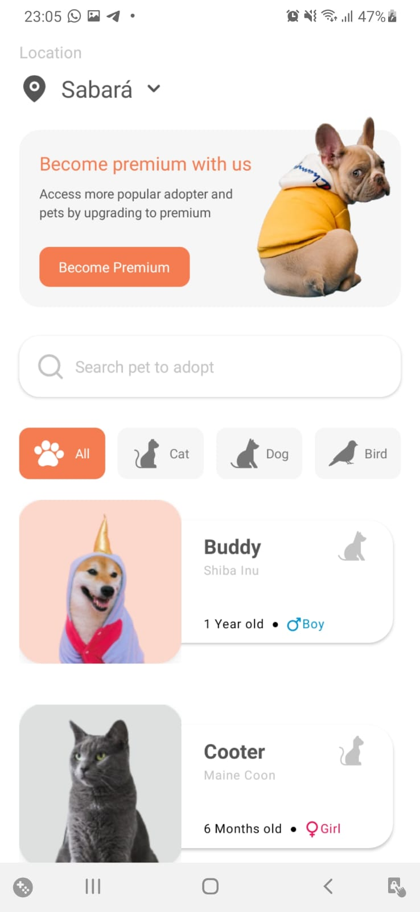
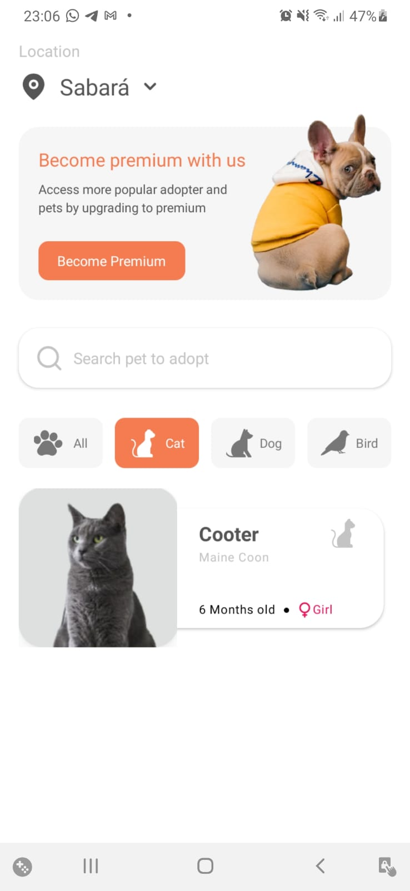
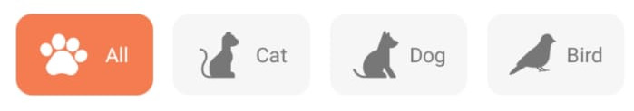

# pets
#####   A ReactNative App build with an amazing free design found in uplabs 
**Credits**: http://www.uplabs.com/posts/pet-adoption-app-concept

### Screenshots
 


---

### Features
  - Filter pet by category type 
  
  - Search pet by its name 
  
  - **TO DO:** Fetch atual device location
  - **TO DO:** Show pet info when click on its Card

---

### Troubles

1. **SVG Import fails**                                                                                                     
☑️ **SOLVED**

- Had to install 2 libs
- react-native-svg
- react-native-svg-transformer  (DEV)
- Had to craete and declaration types file to make it work

```tsx
declare module '*.svg' {
	import {SvgProps} from 'react-native-svg';
	const content: *React*.*FC*<*SvgProps*>;
	export default content;
}
```

2. **Custom fonts Import**                                                                                             
☑️ **SOLVED**

- Had to create the directory /assets/fonts and place the downloaded font inside
- Had to create a file named react-native-config.js in root with this configs:

```tsx
module.exports = {
  assets: ['./assets/fonts/'],
};
```

- IMPORTANT: 
- font-family in css need to have exactly the same name as the .ttf file
- The .ttf file should follow some patterns like: 
    - Capitalize
    - Replace spaces with hifen 
EXAMPLE: MontserratAlternates-Medium

3. **Input Select/Picker Oficial Deprecated, need to install community-lib**       
☑️ **SOLVED**

- Had to install custom picker that doesnt work ( unknown errors shown )
- Thinking about create a custom component to solve it
- Solved by running npx react-native run-android again

4. **Nested styles doesn't work**                                                                                 
❌ **UNSOLVED**  

- Had to create multiples styles and multiple Styled Components
- Had to use StyleSheet in some cases and wasn't my idea to work with two style types
